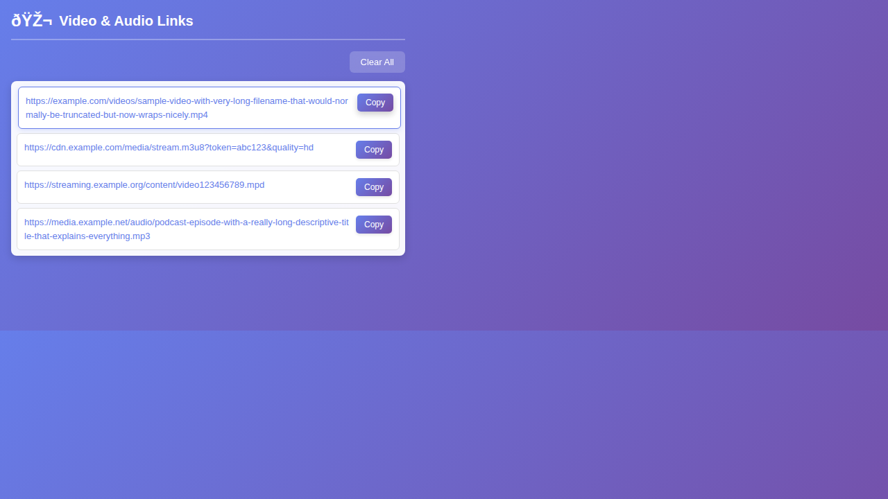

# Video Link Extractor Pro

A Chromium extension that detects video/audio URLs from network traffic, page media elements, and API responses, then gives you quick actions to preview or copy them.



*Current popup UI (v4.2) with thumbnails, preview, and copy helpers.*

## Features

- **Multi-source detection**: Captures media links from:
  - network requests (`webRequest`)
  - response `Content-Type` headers
  - page `<video>`, `<audio>`, and `<source>` tags
  - JSON/XHR/fetch payloads containing media URLs
- **Broad format support**: Detects common streaming/video/audio links like M3U8, MPD, MP4, WebM, MP3, AAC, FLAC, WAV, OGG, OPUS, and more.
- **Per-link actions**:
  - **Video**: try in-popup playback
  - **Copy**: copy raw URL
  - **yt-dlp**: copy command with referer/origin headers
  - **+ Ref**: copy `URL|Referer` payload
- **Thumbnails & referer context**: Shows poster/thumbnail and source host when available.
- **Per-tab isolation + cleanup**: Keeps links per tab and clears closed tabs automatically.
- **Toolbar badge count**: Displays detected media count directly on the extension icon.

## Installation

1. Clone this repository.
2. Open your Chromium browser extensions page:
   - Chrome: `chrome://extensions/`
   - Edge: `edge://extensions/`
   - Brave: `brave://extensions/`
   - Opera: `opera://extensions/`
3. Enable **Developer mode**.
4. Click **Load unpacked** and select this project folder.

## Usage

1. Open a page with media content.
2. Play or interact with the media if needed.
3. Open the extension popup.
4. Use **Copy All**, per-link actions, or **Clear** for the active tab.

## How It Works

### Core Files

- `background.js`: central detection logic, tab-scoped storage, badge updates, and preview header rules.
- `inject.js`: hooks fetch/XHR in page context to sniff media URLs in payloads.
- `content.js`: scans DOM/shadow DOM media elements and reports discovered links.
- `popup.html` + `popup.js`: UI rendering, preview playback, and copy actions.

### Permissions

- `webRequest`: inspect outgoing requests/responses for media signals.
- `declarativeNetRequest`, `declarativeNetRequestWithHostAccess`: set temporary preview headers (referer/origin).
- `activeTab`, `scripting`: interact with the current tab and trigger content scans.
- `clipboardWrite`: copy URLs/commands from the popup.
- `host_permissions: <all_urls>`: detect media across sites.

## Project Structure

```text
video_link_extractor/
├── manifest.json
├── background.js
├── inject.js
├── content.js
├── popup.html
├── popup.js
├── icons/
└── README.md
```

## Testing

Manual validation flow:
- Load extension in Developer mode
- Visit media-heavy pages
- Confirm links appear in popup
- Confirm Copy / yt-dlp / + Ref actions
- Confirm preview toggle works when source allows playback
- Confirm badge updates and tab cleanup behavior

## Version

- **v4.2** (current)
  - Enhanced detection (network + content scan + payload sniffing)
  - Added thumbnail/referer-aware card rendering
  - Added in-popup preview and downloader-oriented copy helpers
  - Added badge count and improved per-tab handling

## Privacy

- No data is sent to external servers.
- Processing is local in your browser.
- Link data is kept in memory and removed when tabs close.

## Repository

- https://github.com/jrcramos/video_link_extractor
